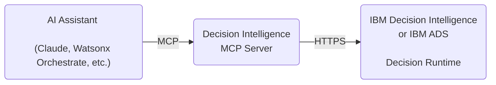
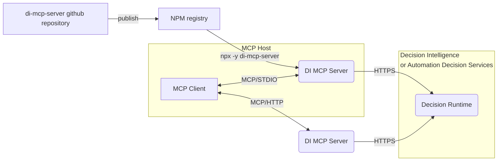

# MCP server for IBM Decision Intelligence and IBM Automation Decision Services

[](https://github.com/DecisionsDev/di-mcp-server/actions/workflows/build.yml) [](LICENSE) [](https://www.npmjs.com/package/di-mcp-server) 



This Model Context Protocol (MCP) server empowers AI assistants by accessing decisions from [IBM Decision Intelligence](https://www.ibm.com/products/decision-intelligence) or [IBM Automation Decision Services](https://www.ibm.com/products/automation-decision-services).

The MCP server is available as an npm package in the free npm registry at https://www.npmjs.com/package/di-mcp-server.

It supports both STDIO and streamable HTTP transports for local or remote deployments for supporting any MCP clients.

<a id="resources"></a>
## Resources

- [Supercharge your AI Assistants with the decisioning capabilities of IBM Decision Intelligence](https://community.ibm.com/community/user/blogs/jean-philippe-orsini/2025/08/22/decision-intelligence-mcp-server): Step-by-step instructions on how to use the MCP server for IBM Decision Intelligence.
- [Trusted automated decisions in Agentic application with IBM Decision Intelligence and MCP](https://www.youtube.com/watch?v=GEgelNg4uaM): This video shows how an agentic application can leverage automated decision services that are defined and hosted in the IBM Decision Intelligence platform to make accurate and explainable decisions.
- [Enrich your watsonx Orchestrate chat experience with IBM Decision Intelligence](https://medium.com/@orsinije/decision-intelligence-mcp-server-tutorial-watsonx-orchestrate-4d5a200fbe08): Step-by-step instructions on how to use the decisioning capability in IBM watsonx Orchestrate.

<a id="getting_started"></a>
## Getting started with the MCP server

You can use the MCP server available in the npm registry.
To develop your own MCP server or contribute to the development, see [Developing the MCP server](DEVELOPING.md).

You can run the MCP server with npx to expose each operation of the last deployed version of a decision service as an MCP tool.

### For IBM Decision Intelligence

Create the MCP server by using decisions that are deployed in Decision Intelligence:
```bash
npx -y di-mcp-server --di-apikey <YOUR_DI_API_KEY> --url https://mytenant.decision-prod-us-south.decision.saas.ibm.com/ads/runtime/api/v1
```

### For IBM Automation Decision Services

#### Zen API key authentication

Create the MCP server by using decisions that are deployed in Automation Decision Services that uses the Zen API key authentication:

```bash
npx -y di-mcp-server --authentication-mode zenapikey --zen-username <YOUR_ZEN_USERNAME> --zen-apikey <YOUR_ZEN_API_KEY> --url https://myads-hostname/ads/runtime/api/v1
```

#### Basic authentication

Create the MCP server by using decisions that are deployed in Automation Decision Services that uses the basic authentication:

```bash
npx -y di-mcp-server --authentication-mode basic --basic-username <YOUR_USERNAME> --basic-password <YOUR_PASSWORD> --url https://myads-hostname/ads/runtime/api/v1
```

### Command line syntax

Syntax of the command line:
```bash
npx -y di-mcp-server [--authentication-mode <AUTHENTICATION_MODE>] <CREDENTIALS> --url <RUNTIME_BASE_URL> [--transport <TRANSPORT>] [--deployment-spaces <DEPLOYMENT_SPACES>] [--decision-service-ids <DECISION_SERVICE_IDS>]
```

where
- `AUTHENTICATION_MODE` (optional) is the authentication mode to access the decision runtime; either `diapikey` (default), `zenapikey`, or `basic` respectively for authenticating with the Decision Intelligence API key, Zen API key, or basic credentials (i.e. username and password)
- `CREDENTIALS` is one of the following options, depending on the chosen authentication mode:
    - For Decision Intelligence API key authentication: `--di-apikey <DI_API_KEY>` where `DI_API_KEY` is the API key to access the decision runtime for Decision Intelligence.
    - For Zen API key authentication: `--zen-username <ZEN_USERNAME> --apikey <ZEN_API_KEY>` where `ZEN_USERNAME` and `ZEN_API_KEY` are the Zen API key credentials to access the decision runtime for Automation Decision Services (see [Authorizing HTTP requests by using the Zen API key](https://www.ibm.com/docs/en/cloud-paks/cp-biz-automation/25.0.0?topic=administering-authorizing-http-requests-by-using-zen-api-key))
    - For basic authentication: `--basic-username <BASIC_USERNAME> --basic-password <BASIC_PASSWORD>` where `BASIC_USERNAME` and `BASIC_PASSWORD` are the basic authentication credentials to connect to the decision runtime for Automation Decision Services.
- `RUNTIME_BASE_URL` is the base URL of the decision runtime REST API. For Decision Intelligence, its pattern is: `https://<TENANT_NAME>.decision-prod-us-south.decision.saas.ibm.com/ads/runtime/api/v1` where TENANT_NAME is the name of the tenant.
- `TRANSPORT` (optional) is the transport protocol, either `stdio` (default) or `http`.
- `DEPLOYMENT_SPACES` (optional) is a comma-separated list of deployment spaces to scan (defaults to `development`).
- `DECISION_SERVICE_IDS` (optional) If defined, a comma-separated list of decision service IDs are exposed as tools

The following environment variables can be used in addition to the command line options.

| CLI Option             | Environment Variable | Description                                                                                                  |
|------------------------|----------------------|--------------------------------------------------------------------------------------------------------------|
| --authentication-mode  | AUTHENTICATION_MODE  | (Optional) Authentication mode to connect to the decision runtime: `diapikey` (default), `zenapikey` or `basic` |
| --di-apikey            | DI_APIKEY            | Decision Intelligence API key                                                                                |
| --zen-username         | ZEN_USERNAME         | Zen username                                                                                                 |
| --zen-apikey           | ZEN_APIKEY           | Zen API key                                                                                                  |
| --basic-username       | BASIC_USERNAME       | Basic authentication username                                                                                |
| --basic-password       | BASIC_PASSWORD       | Basic authentication password                                                                                |
| --decision-service-ids | DECISION_SERVICE_IDS | (Optional) Comma-separated list of decision services (default: fetch all decision services)                    |
| --deployment-spaces    | DEPLOYMENT_SPACES    | (Optional) Comma-separated list of deployment spaces to scan (default: `development`)                          |
| --debug                | DEBUG                | When the value is `true`, the debug messages are written to the `stderr` of the MCP server                   |
| --transport            | TRANSPORT            | (Optional) Transport protocol: `stdio` (default) or `http`                                                     |
| --url                  | URL                  | Base URL of the decision runtime </br>                                                                       |

<a id="ai_applications"></a>
## Integrating decision services into AI applications

The MCP server for Decision Intelligence extends its capability by enabling AI applications, such as IBM watsonx Orchestrate and Claude, to discover and execute deployed decision services.

### Integrating decision services into IBM watsonx Orchestrate

The article [Enrich your watsonx Orchestrate chat experience with IBM Decision Intelligence](https://medium.com/@orsinije/decision-intelligence-mcp-server-tutorial-watsonx-orchestrate-4d5a200fbe08) demontrates how to integrate the capability to discover and execute decisions in an IBM watsonx Orchestrate agent by using the Decision Intelligence MCP server.

See the [IBM watsonx Orchestrate integration page](./doc/integration-wxo.md) for passing sensitive configuration settings to the IBM Decision Intelligence MCP Server.

### Integrating decision services into Claude Desktop

You can integrate decision services into Claude Desktop by adding the MCP server.

1. Locate the Claude Desktop configuration file.

   Find your Claude configuration directory:
   - **macOS**: `~/Library/Application\ Support/Claude/claude_desktop_config.json`
   - **Windows**: `%APPDATA%\Claude\claude_desktop_config.json`
   - **Linux**: `${HOME}/.config/Claude/claude_desktop_config.json`


2. Add the MCP server configuration to the configuration file.

   - In the configuration directory, edit or create `claude_desktop_config.json`:

      ```json
      {
          [..]
          "mcpServers": {
              "di-mcp-server": {
                  "command": "npx",
                  "args": [
                      "-y",
                      "di-mcp-server",
                      "--di-apikey",
                      "<APIKEY>",
                      "--url",
                      "https://<TENANT_NAME>.decision-prod-us-south.decision.saas.ibm.com/ads/runtime/api/v1"
                  ]
              }
          }
          [..]
      }
      ```
   - Alternatively, you can use the `APIKEY` and `URL` environment variables to respectively specify the API key and the base URL of the decision runtime REST API:

      ```json
      {
          [..]
          "mcpServers": {
              "di-mcp-server": {
                  "command": "npx",
                  "args": ["-y", "di-mcp-server"],
                  "env": {
                      "DI_APIKEY": "<APIKEY>",
                      "URL": "https://<TENANT_NAME>.decision-prod-us-south.decision.saas.ibm.com/ads/runtime/api/v1"
                  }
              }
          }
          [..]
      }
      ```

For more information, see https://modelcontextprotocol.io/quickstart/user.

### Integrating decision services into Cursor

You can integrate decision services into Cursor by adding the MCP server.

1. In Cursor, click the cog wheel icon to open the Cursor settings.

2. Click **Tools & Integration** in the settings categories that are listed on the left.

   [](doc/cursor1.png)

3. Click **+ New MCP Server**, to open Cursor's `mcp.json` configuration file.

   [](doc/cursor2.png)

4. Add a new MCP server entry.

   As for Claude Desktop, you can specify the API key and base URL of the decision runtime REST API using with one of the following methods:
   - Using command line arguments:
      ```json
      {
          [..]
          "mcpServers": {
              "di-mcp-server": {
                  "command": "npx",
                  "args": [
                      "-y",
                      "di-mcp-server",
                      "--di-apikey",
                      "<APIKEY>",
                      "--url",
                      "https://<TENANT_NAME>.decision-prod-us-south.decision.saas.ibm.com/ads/runtime/api/v1"
                  ]
              }
          }
          [..]
      }
      ```
   - Using environment variables: 
      ```json
      {
          [..]
          "mcpServers": {
              "di-mcp-server": {
                  "command": "npx",
                  "args": ["-y", "di-mcp-server"],
                  "env": {
                      "DI_APIKEY": "<APIKEY>",
                      "URL": "https://<TENANT_NAME>.decision-prod-us-south.decision.saas.ibm.com/ads/runtime/api/v1"
                  }
              }
          }
          [..]
      }
      ```

For more information, see [_Installing MCP servers_](https://docs.cursor.com/en/context/mcp#installing-mcp-servers) in the Cursor documentation.

## Using custom tool names

When you integrate with MCP hosts, you might need to customize the tool names to meet specific requirements or limitations, such as:
- Maximum length restrictions
- Forbidden characters
- Naming conventions

### Default tool naming algorithm

By default, tool names are generated in the following way:
1. Combines the decision service name with the operation ID: `decisionServiceName operationID`
2. Replaces spaces and forward slashes with underscores: `decisionServiceName_operationID`
3. Handles name collisions by using the decision service ID: use `decisionServiceID_operationID` if `decisionServiceName_operationID` already exists 

### Customizing tool names with the decision runtime REST API

If the default naming strategy doesn't meet the requirements of your MCP hosts, you can specify custom tool names by setting the `mcpToolName.OPERATION_ID` decision metadata:
```json
{
  "map": {
    [..]
    "mcpToolName.OPERATION_ID": {
      "name": "mcpToolName.OPERATION_ID",
      "kind": "PLAIN",
      "readOnly": false,
      "value": "YourCustomToolName"
    }
    [..]
  }
}
```
where
- `OPERATION_ID` is the operation unique identifier
- `YourCustomToolName` is the desired tool name for the operation

## Technical details




## License
[Apache 2.0](LICENSE)

## Notice

```text
Copyright contributors to the IBM ADS/Decision Intelligence MCP Server project

Licensed under the Apache License, Version 2.0 (the "License"); you may not use this file except in compliance with the License.You may obtain a copy of the License at http://www.apache.org/licenses/LICENSE-2.0

Unless required by applicable law or agreed to in writing, software distributed under the License is distributed on an "AS IS" BASIS, WITHOUT WARRANTIES OR CONDITIONS OF ANY KIND, either express or implied. See the License for the specific language governing permissions and limitations under the License.
```

